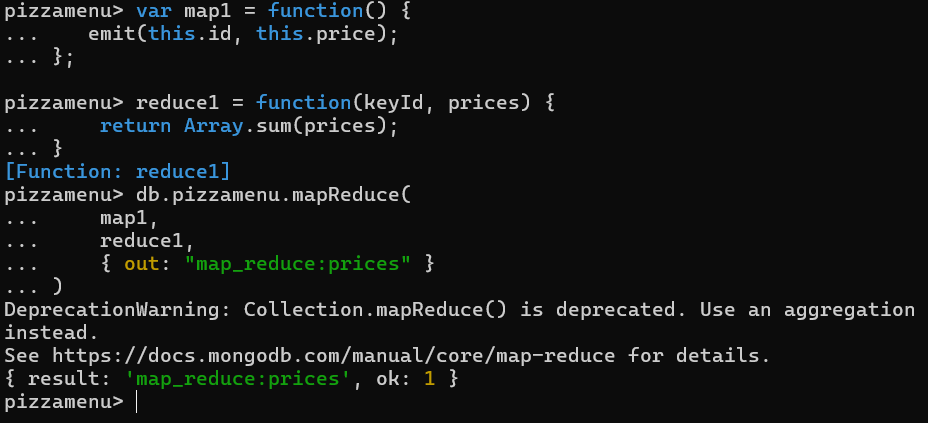

# MongoDB 
For this assignment we were to familiarize ourselves with MongoDB by following its 
[official tutorial](https://www.mongodb.com/lp/cloud/atlas/try4?utm_source=google&utm_campaign=search_gs_pl_evergreen_atlas_general_prosp-brand_gic-null_emea-no_ps-all_desktop_eng_lead&utm_term=mongodb%20tutorial&utm_medium=cpc_paid_search&utm_ad=e&utm_ad_campaign_id=10947982929&adgroup=108885994073&cq_cmp=10947982929&gad_source=1&gclid=Cj0KCQjwo8S3BhDeARIsAFRmkOPaCjYHQO-d60uTbQanbkmwg_Q4M_HFA0gDrgjddgf-EpDv1_p1mWsaAjq-EALw_wcB).

I started with reading the [introduction page](https://www.mongodb.com/docs/manual/introduction/) before doing this 
[tutorial](https://www.mongodb.com/docs/manual/tutorial/getting-started/). 

## Installing MongoDB
I followed the [instructions](https://www.mongodb.com/docs/manual/administration/install-community/) for installing 
MongoDB. 

### Verifying the Integrity of MongoDB Package
I followed [this](https://www.mongodb.com/docs/manual/tutorial/verify-mongodb-packages/) when verifying the MongoDB package before starting the installation. 

I created a file in my Downloads called XXX and pasted in
> 778f03552b6638822c18a9a2e8996d31cf12e4c9b87ffc73be8ce71e0a8465e9  mongodb-windows-x86_64-8.0.0.msi

Then I opened Windows PowerShell and ran the command 

```
$sigHash = (Get-Content $Env:HomePath\Downloads\mongodb-windows-x86_64-8.0.0-signed.msi.sha256 | Out-String).SubString(0,64).ToUpper(); `
$fileHash = (Get-FileHash $Env:HomePath\Downloads\mongodb-windows-x86_64-8.0.0-signed.msi).Hash.Trim(); `
echo $sigHash; echo $fileHash; `
$sigHash -eq $fileHash
```

But for some reason, it couldn't find the file I'd saved. You can see in the print screen below that I had it correctly.


The name of and the path to the file is correct, the SHA is for the correct version of MongoDB, and the two SHA's are 
identical once you set everything to upper case. 

I decided not to waste too much time on figuring out what went wrong and decided to continue downloading.
Note that I would NOT have skipped the verification had it been a file from a less reliable source. 

### Installation

All went well with downloading the
[Windows version](https://www.mongodb.com/docs/manual/tutorial/install-mongodb-on-windows/#std-label-install-mdb-community-windows); 
I ran the executable which started the installing process (with the default settings) and added the path in my 
environmental variables. 

But when it came to actually launching it, I encountered my first obstacle. When following these installation 
[instructions](https://www.mongodb.com/docs/manual/tutorial/install-mongodb-on-windows/#run-mongodb-from-cmd), I got 
all the way to _Step 2 "Start your MangoDB database"_, before having to stop and check that everything had been done 
correctly. 

After creating the new directory `\data\db` inside `C:\`, I ran 
`"C:\Program Files\MongoDB\Server\8.0\bin\mongod.exe" --dbpath="c:\data\db"` and got this output: 


This confused me since I did not get the output: `[initandlisten] waiting for connections` which it said should be 
displayed in the command interpreter if the MangoDB database was running correctly.

So, I uninstalled the program and instead followed this [tutorial](https://www.geeksforgeeks.org/how-to-install-mongodb-on-windows/) 
from GeeksForGeeks, and simultaneously this [tutorial](https://www.youtube.com/watch?v=gB6WLkSrtJk) where they point
out that the _MongoDB Shell_ needed to be downloaded separately.

After downloading and installing the shell via this [link](https://www.mongodb.com/docs/mongodb-shell/install/), I kept
reading the GeeksForGeeks tutorial, where they explained that the output I got the first time, after running the command
`"C:\Program Files\MongoDB\Server\8.0\bin\mongod.exe" --dbpath="c:\data\db"`, was in fact, just the MongoDB server 
running. 

I also figured out, thanks to this [question](https://stackoverflow.com/questions/73081708/mongo-exe-not-installed-in-version-6-0-0/73208435#73208435) 
from StackOverflow, that the correct command for starting the shell is `mongosh` and not `mongo`.


Now, that I got the server running and had connected to the shell, I opened _MongoDB Compass_, a Graphical User
Interface (GUI) which acts like a client for the MongoDB server. And to connect to the default MongoDB Server database, 
I used the default URL: `mongodb://localhost:27017`.

Once I connected the server and client for MongoDB, I created a new database and started to explore the CURD (create, 
update, read, delete) operations. 

### Inserting Documents 
I followed this [tutorial](https://www.mongodb.com/docs/manual/tutorial/insert-documents) for inserting documents. 

First I used _MongoDB Compass_ to create a new database called "myDB", and in it, I created a collection called 
"inventory". I navigated to the collection and click "ADD DATA". A window opened that prompted for a JSON file, so I 
copied the example code from the tutorial and pasted it there.
```
[
   { "prodId": 100, "price": 20, "quantity": 125 },
   { "prodId": 101, "price": 10, "quantity": 234 },
   { "prodId": 102, "price": 15, "quantity": 432 },
   { "prodId": 103, "price": 17, "quantity": 320 }
]
```

After pressing "Insert", I could see the documents in my database. I also opened the shell and looked at them there. 


### Inserting a Single Document
In MongoDB Shell I used the command `db.inventory.insertOne({ "prodid": 104, "price": 18, "quantity": 260})`
to insert a single document in the collection.

I used the following code to insert many documents through the shell (instead of inside MongoDB Compass): 

```
db.inventory.insertMany([
   { "prodId": 105, "price": 12, "quantity": 620 },
   { "prodId": 106, "price": 23, "quantity": 340 },
   { "prodId": 107, "price": 29, "quantity": 480 },
   { "prodId": 108, "price": 37, "quantity": 500 }
])
```

### Query Documents
When querying documents in MongoDB Compass, I simply use the command `db.inventory.find()` to find all elements in the 
collection. If I want to query for something specific, like by price or quantity, I can for example use the command, 

`db.inventory.find( {"price": 37} )` to find all elements with price value equal to 37,

`db.inventory.find({ $or [ {"price": 37}, {"price": 12} })` to find elements with the price value 37 or 12, or

` db.inventory.find({ $or: [ {"quantity": {$gte: 300}}, {"price": 12}]})` to find elements with quantity 
value greater than 300 or price value equal to 12.


### Update Documents 
When _updating_ documents I can use the command `updateOne()` to update a field in an element. For instance, 
I can update an element by product id with the command 

`db.inventory.updateOne({"prodId": 100}, { $set: {"price": 200}, {"quantity": 500} })`

Or if I want to update many elements based on a field value, I can use the command `updateMany()` to change the 
price of all elements with quantity greater than 400 to have price set to 50 with the command 

`db.inventory.updateMany({ "quantity": {$gte: 400} }, {$set: {"price": 50}})`

If I want to _replace_ an element entirely, I can use `db.inventory.replaceOne()` and for example replace the element
with _id 108_ with another element which also gets _id 108_, but different _price_ and _quantity_.

`db.inventory.replaceOne({"prodId":108}, {"prodId":108, "price":700, "quantity":2})`:


If I want to _delete_ one or many elements, I can use 

`db.inventory.deleteOne()` or `db.inventory.deleteMany()`: 


### Bulk Write Operations
It is also possible to perform several operations in the shell at once. For instance, I can add two new products in my 
inventory, update another, and delete and replace two others with the following code:

```
try {
   db.inventory.bulkWrite( [
      { insertOne: { document: { "prodId": 105, "price": 10, "quantity": 300 } } },
      { insertOne: { document: { "prodId": 106, "price": 20, "quantity": 300 } } },
      { updateOne: {
         filter: { "price": 50 },
         update: { $set: { "price": 75 } }
      } },
      { deleteOne: { filter: { "prodId": 104} } },
      { replaceOne: {
         filter: { "prodId": 103 },
         replacement: { "prodId": 107, "price": 30, "quantity": 300 }
      } }
   ] )
} catch( error ) {
   print( error )
}
```


# Aggregation
I created a new database "pizzamenu" and added several pizzas using the commands 
```
> show collections
> db.createCollection("pizzamenu")
> use pizzamenu
> db.pizzamenu.insertMany([
    { "id": 1, "name": "Margarita", "toppings": ["tomato sauce", "cheese"], "price": 110 },
    { "id": 2, "name": "Bolognese" , "toppings": ["tomato sauce", "cheese", "meat sauce"] , "price": 150 },
    { "id": 3, "name": "Hawaii" , "toppings": ["tomato sauce", "cheese", "ham", "pineapple"], "price": 150 },
    { "id": 4, "name": "ChickenBBQ" , "toppings": ["tomato sauce", "cheese", "mushrooms", "barbeque chicken", "onion"], 
      "price": 180 },
    { "id": 5, "name": "Vegetariana", "toppings": ["tomato sauce", "cheese", "mushrooms", "bell peppers", "onion", 
      "corn", "olives"] , "price": 90 },
])

// Update all prices by multiplying by 1.1
> db.pizzamenu.updateMany( {}, [{
    $set: {
        price: { $multiply: ["$price", 1.1] }
    }
  }])
  
// Update all prices by multiplying by 0.9
> db.pizzamenu.updateMany( {}, [{ 
    $set: {
        price: { $multiply: ["$price", 0.9] } 
        } 
    }])
```
After that I tried to select all pizzas with 5 or more toppings, and give them size = large, while the others got 
size = small. I managed to filer out the pizzas with five or more toppings with this code: 

```
db.pizzamenu.aggregate([
    {
        $addFields: {
            "size": {$size: "$toppings"}
            },
        },
	{
	    $match: {
	        size: {$gte: 5} 
	    }, 
	},])
```
But I only got the output: 
```
[
  {
    _id: ObjectId('66f1dabc2774de7b61c73c02'),
    id: 4,
    name: 'ChickenBBQ',
    toppings: [
      'tomato sauce',
      'cheese',
      'mushrooms',
      'barbeque chicken',
      'onion'
    ],
    price: 178.20000000000002,
    size: 5
  },
  {
    _id: ObjectId('66f1dabc2774de7b61c73c03'),
    id: 5,
    name: 'Vegetariana',
    toppings: [
      'tomato sauce',
      'cheese',
      'mushrooms',
      'bell peppers',
      'onion',
      'corn',
      'olives'
    ],
    price: 89.10000000000001,
    size: 7
  }
]
```
So I managed to select them, but I didn't set the size to a string. I tried again with 
```
db.pizzamenu.updateMany( {}, [{
    $set: {
        size: {
            $cond: {
                if: { $gte: ["$size", "toppings"] },
                then: "Large",
                else: "Small"
                }
            }
        }
    }
])
```

And it did put a string in the field "size", but all the pizzas were put to be "Small". 

## Map-Reduce




---
In particular, you should write about:

    Technical problems that you encountered during installation and use of MongoDB and how you resolved

    Screenshots for:

        The correct validation of the installation package (https://docs.mongodb.com/manual/tutorial/verify-mongodb-packages/)

        Relevant results obtained during Experiment 1 (it is not necessary to put a single screenshot on each substep, 
        but at least one significant from each CRUD operation).

        Experiment 2 example working and the additional Map-reduce operation (and its result) developed by each of you.

        Reason about why your implemented Map-reduce operation in Experiment 2 is useful and interpret the collection 
        obtained.

        Any pending issues with this assignment which you did not manage to solve

The hand-in should be written in English.