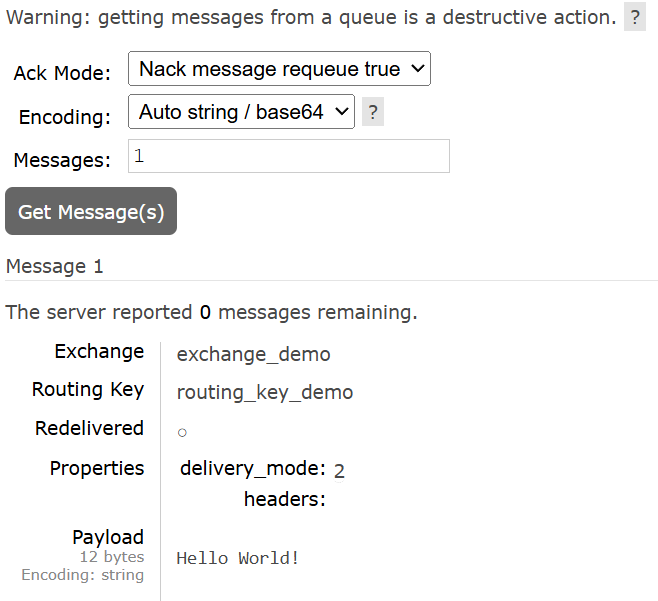

# RabbitQM
I am following this [video tutorial](https://www.youtube.com/watch?v=TvxhuAUJGUg&list=PLGRDMO4rOGcMh2fAMOnwuBMDa8PxiKWoN&ab_channel=JavaGuides)
by Java Guides on [YouTube](https://www.youtube.com/).
---
The toturial will go thorough: 
1. **Core concepts of RabbitMQ**, such as 
   - Producer
   - Consumer
   - Queue
   - Exchange
   - Binding
   - Routing Key
   - Message


2. **RabbitMQ architecture**:
   
    `Producer >> Message >> RabbitMQ Message Broker >> Message >> Consumer`

    Here the producer send a message to the RabbitMQ Message Broker who in turn send a message to the Consumer.


3. **How to integrate RabbitMQ in a SpringBoot project**, using the Spring AMQP (Advanced Message Queuing Protocol) library. 
RabbitMQ uses Spring AMQP for messaging protocols.
4. **How to connect a springboot application to a RabbitMQ server**. 
5. **How to configure all the RabbitMQ components in a SpringBoot application.** 
6. **How to use a message (of type string) for communication between the producer and consumer** using RabbitMQ Broker in a 
SpringBoot application. 
7. **How to use a message (of type JSON) for communication between the producer and consumer** using RabbitMQ Broker in a 
SpringBoot project.
8. **How to create a multiple queue in a RabbitMQ architecture** and also create multiple consumers who'll subscribe to 
multiple queues.

### What is Message Queuing?
Message queuing allows applications to communicate by sending messages to each other. The message queue provides 
temporary message storage when the destination program is busy or not connected. A message queue if made up of a 
producer, a broker, and a consumer. A message queue provides an asynchronous communication between applications. Both 
a producer and a consumer can be different applications. 

### What is RabbitMQ?
RabbitMQ is a message queue software (message broker/queue manager) that acts as an intermediary platform where 
different applications can send and receive messages. RabbitMQ originally implemented the Advanced Message Queuing 
Protocol (AMQP), but now it also supports several other API protocols such as STOMP, MQTT, and HTTP. 

The producer is an application that sends messages to the RabbitMQ broker and Consumer is an application that reads 
messages from the RabbitMQ broker.

> Use of RabbitMQ in Microservices
> 
> RabbitMQ is one of the simplest freely available options for implementing messaging queues in microservice architecture. 

### Core Concepts 
`Producer` - The producer is an application that sends messages. It does not send messages directly to the consumer, 
but only to the RabbitMQ broker.

`Consumer` - The consumer is an application that reads messages from the RabbitMQ Broker

`Queue` -   The queue is a buffer/storage in a RabbitMQ broker that stores messages. The messages are put into a queue by 
            a producer and read from it by a consumer. Once a message is read, it is consumed and removed from the queue. A message 
            can thus only be processes once.

`Message` - Information that is sent from the producer to a consumer through RabbitMQ.

`Exchange` - Acts as an intermediary between the producer and a queue. Instead of sending messages directly to a queue, 
             a producer can send them to an exchange instead. The exchanges then sends the messages to one or more 
             queues following a specified set of rules. The producer do not need to know the queues that eventually 
             receive those messages. 

`Routing Key` - The routing key is a key that the exchanges look at to decide how to route the message to queues, like 
                an address for the messages.

`Binding` - A binding is a link between a queue and an exchange.

### Architecture
A typical RabbitMQ messaging system architecture consists of a producer that sends a message into the queue via the 
message broker, who in turn sends it to the consumer. In a `simple` RabbitMQ architecture, there's one more component, 
the exchange component, between the producer and the queue. In a more `complex` RabbitMQ architecture, there are 
multiple queues and multiple consumers, and the exchange acts as the router between the producer and the queues, using 
a routing key. So the binding/link between the exchange and the specified queue, is thus dependent on the routing key.

## Experiment 1: Installing and Setting Up RabbitMQ using Docker
I already had [Docker Desktop](https://www.docker.com/products/docker-desktop/) downloaded and installed on my machine, 
so I started with opening it. After that, I opened a browser and typed "docker hub" in the search bar and clicked on the
link for the [Docker Hub Container Image Library](https://hub.docker.com/). Then I searched for RabbitMQ in the search 
bar and clicked on the top-most result, which was the official image library for RabbitMQ. This took me to the page for 
the RabbitMQ Docker Image, where I scrolled down to "Supported Tags and Respective `Dockerfile` links" and scrolled down 
to the second link from the top `4.0.2-management, 4.0-management, 4-management, management`. I copied the first image
name `4.0.2-management` and then I opened the command prompt as admin and ran the command 

`docker pull rabbitmq:4.0.2-management`

and the image started downloading 

 ```
 Microsoft Windows [Version 10.0.22631.4169]
(c) Microsoft Corporation. Med enerett.

C:\Windows\System32>docker --version
Docker version 27.1.1, build 6312585

C:\Windows\System32>docker pull rabbitmq:4.0.2-management
4.0.2-management: Pulling from library/rabbitmq
dafa2b0c44d2: Pull complete
0ae94e6aef35: Extracting  37.16MB/45.45MB
2ad525572aae: Download complete
c01adf267ddc: Download complete
14495391f6cb: Download complete
8666b435d033: Download complete
37a05209e70f: Download complete
dc90a98e5e04: Download complete
45842602427a: Download complete
953a6cb82879: Download complete
 ```

After dowloading, I opened Docker and checked that the image was there, which it was. I could have simply used the 
Docker Desktop to run the RabbitMQ image in a new container, but I chose to run it through the terminal using the
command 

`docker run --rm -it -p 15672:15672 -p 5672:5672 rabbitmq:4.0.2-management`

This command is mapping and exporting the port 15672 (default) for the RabbitMQ management website (plugin), and the second for 
the RabbitMQ client connections (broker). This gave me a long output which ended with the lines 

```
2024-10-01 16:06:40.167168+00:00 [info] <0.635.0> Server startup complete; 4 plugins started.
2024-10-01 16:06:40.167168+00:00 [info] <0.635.0>  * rabbitmq_prometheus
2024-10-01 16:06:40.167168+00:00 [info] <0.635.0>  * rabbitmq_management
2024-10-01 16:06:40.167168+00:00 [info] <0.635.0>  * rabbitmq_management_agent
2024-10-01 16:06:40.167168+00:00 [info] <0.635.0>  * rabbitmq_web_dispatch
 completed with 4 plugins.
2024-10-01 16:06:40.343648+00:00 [info] <0.9.0> Time to start RabbitMQ: 13600 ms
```

I checked that the server was running by opening the browser and going to `localhost:15672` which opened the RabbitMQ
management website which prompted for a username and password.

### Exploring RabbitMQ Using RabbitMQ Management UI
I logged in using the `guest` as username and password. The "Connections" tab in the UI displays all the TCP connections,
so whenever an application is connected to the RabbitMQ server it will show up there. The "Channels" tab displays the
TCP connections that are established between a producer and a consumer using RabbitMQ.

I created a new exchange by clicking on the "Exchanges" tab and scrolling down to the button which said "Add exchange"
and clicking on it. I named the new exchange `exchange_demo` and kept the rest of the default settings before clicking 
"Add exchange". The newly added exchanged showed up in the table of exchanges and I clicked it to open it. 

Now I needed to create a queue as well to provide the exchange with a routing key. I clicked the "Queues and Streams"
tab and added a new queue where I named it `queue_demo` and kept all the default values, except for the `Type`, which I 
changed to `classic` because that's what the tutorial is using (probably because RabbitMQ has gotten updates after it 
was made).

Now, all that remained was to bind them together using the `routing key`. I went back to `exchange_demo`, scrolled down 
to `Bindings`, filled in the name for my queue in the `To queue` field, and added the routing key for `queue_demo` by
writing `routing_key_demo` in the `Routing key` field. As soon as I clicked on "Bind", the new binding appeared in a 
table in the exchange. When I went back to "Queues and Streams", I could see the binding there as well. 

I tested the binding by sending a message from the exchange and into the queue. This was simply done by going to 
"Exchanges" and scrolling to "Publish message". Here I clicked on the arrow which revealed a drop-down menu where I
could enter the fields of the message. I entered the routing key `routing_key_demo` and wrote `Hello World!` in the 
payload field, before clicking on "Publish message". 

As soon as I clicked on "Publish message" a pop-up window appeared to inform me that the message had been published. To 
verify that the message had been successfully routed to the queue, I went back to the "Queues and Streams" tab, 
clicked on my queue and opened the drop-down menu "Get Message(s)". And when I opened it, I could see that my message 
had been sent and received successfully.



## Experiment 2: RabbitMQ tutorial - "Hello World!"
//TODO: Do this using the code [tutorial](https://www.rabbitmq.com/tutorials/tutorial-one-java) as well! 